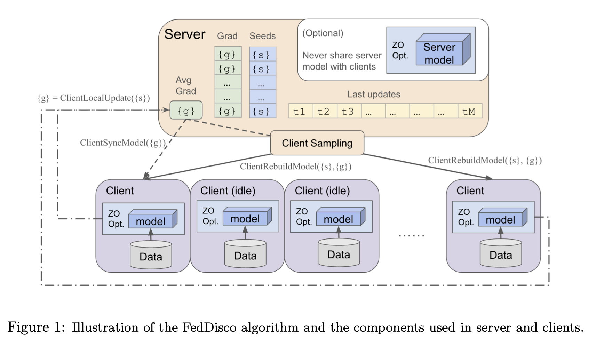

# FedDisco: Achieving Dimension-Free Communication in Federated Learning via Zero-Order Optimization

FedDisco is a research project that implements Zero-Order Optimization (ZOO) methods in Federated Learning (FL) to achieve dimension-free communication. The repository includes code for running experiments using different optimization techniques. The paper can be found [here](https://arxiv.org/pdf/2405.15861).



NOTE: In code implementation we use `cezo_fl` for `FedDisco` in paper

## Table of Contents

- [Installation](#installation)
- [Experiments](#experiments)
- [Project Structure](#project-structure)
- [Contributing](#contributing)

## Installation

1. Clone the repository:

   ```bash
   git clone https://github.com/ZidongLiu/FedDisco.git
   cd FedDisco
   ```

2. Create a virtual environment and activate it:

   ```bash
   python3 -m venv venv
   source venv/bin/activate
   ```

3. Install the required packages:
   ```bash
   pip install -r requirements.txt
   ```

## Experiments

### ZOO Random Gradient Estimate (RGE) + SGD Training

Train a model using ZOO RGE:

```bash
python rge_main.py --dataset=cifar10 --num-pert=10 --lr=1e-6 --mu=1e-3
```

### Run on Multiple Clients

Split data into chunks and train on multiple clients clients:

```bash
python cezo_fl_main.py --dataset=sst2 --iterations=10000 --train-batch-size=8 --test-batch-size=200 --eval-iterations=50 --num-clients=3 --num-sample-clients=2 --local-update-steps=1 --num-pert=10 --lr=1e-6 --mu=1e-3 --grad-estimate-method=rge-forward
```

## Project Structure

```
FedDisco/
├── cezo_fl/
│ ├── **init**.py
│ ├── cezo_fl_main.py
│ └── ...
├── data/
│ ├── **init**.py
│ └── ...
├── gradient_estimators/
│ ├── **init**.py
│ └── ...
├── models/
│ ├── **init**.py
│ └── ...
├── pruning/
│ ├── **init**.py
│ └── ...
├── results/
│ ├── **init**.py
│ └── ...
├── shared/
│ ├── **init**.py
│ └── ...
├── tests/
│ ├── **init**.py
│ └── ...
├── .gitignore
├── LICENSE
├── README.md
├── config.py
├── generate_pruning_sparsity.py
├── llm_sst2_fine_tune.py
├── preprocess.py
├── requirements.txt
├── setup.py
├── slurm_main.sh
└── test_large_model.py
```

### Key Components

- **cezo_fl/**: Contains code specific to FedDisco.
- **data/**: Datasets used for experiments.
- **gradient_estimators/**: Gradient estimation methods.
- **models/**: Model architectures used in experiments.
- **pruning/**: Code related to model pruning techniques.
- **results/**: Output results from experiments.
- **shared/**: Shared utilities and helper functions.
- **tests/**: Unit and integration tests.

### Files

- **config.py**: Configuration settings.
- **generate_pruning_sparsity.py**: Script for generating pruning sparsity.
- **llm_sst2_fine_tune.py**: Fine-tuning script for large language models on SST-2 dataset.
- **preprocess.py**: Data preprocessing script.
- **slurm_main.sh**: SLURM job submission script.
- **test_large_model.py**: Testing script for large models.

## Contributing

We welcome contributions to the project. If you are interested in contributing, please follow these steps:

1. Fork the repository.
2. Create a new branch (git checkout -b feature-branch).
3. Commit your changes (git commit -am 'Add new feature').
4. Push to the branch (git push origin feature-branch).
5. Create a new Pull Request.
